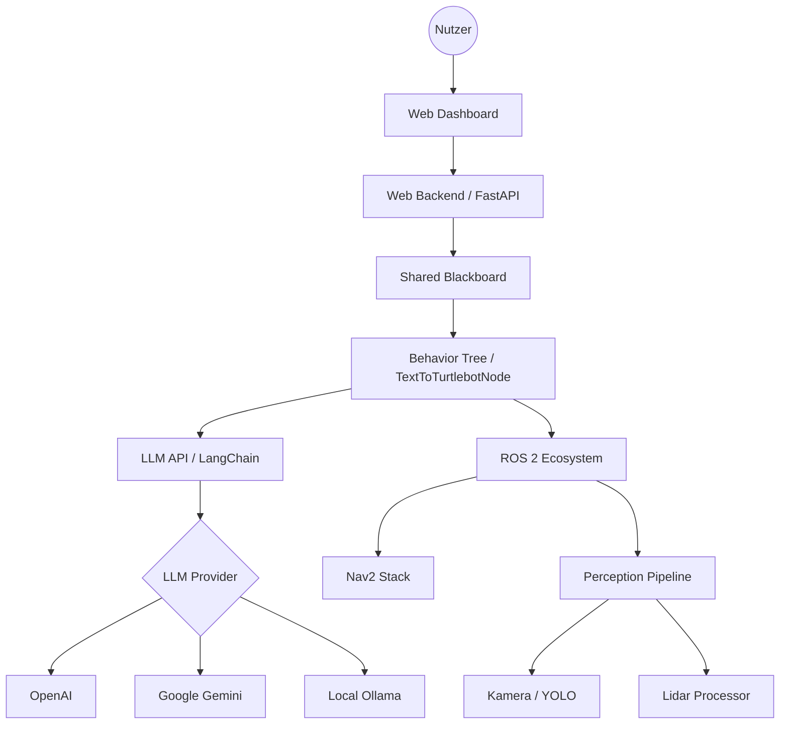

# Architektur

TextToTurtleBot ist modular aufgebaut, um eine flexible Integration von KI-Modellen und Robotersteuerung zu ermöglichen.

## Systemübersicht

Die folgende Grafik zeigt die grobe Architektur des Systems:

## Datenfluss

Der Datenfluss bei einem Sprachbefehl sieht wie folgt aus:

1.  Der Nutzer gibt einen Text im **Web Dashboard** ein.
2.  Das **Web Backend** empfängt den Text und leitet ihn an den **TextToTurtlebotNode** weiter.
3.  Der **LLM API** Dienst analysiert den Text mithilfe eines LLM-Adapters und generiert strukturierte Kommandos.
4.  Diese Kommandos werden in den **Behavior Tree** eingespeist.
5.  Der Verhaltensbaum führt die entsprechenden **Skills** (z.B. Navigation, Objektsuche) aus, indem er mit dem **ROS 2 Ecosystem** interagiert.
6.  Zustands- und Sensordaten werden kontinuierlich über das **Blackboard** synchronisiert und im Dashboard visualisiert.

## Kernkomponenten

### core/
Enthält die Hauptlogik des Roboters, einschließlich der Verhaltensbäume, LLM-Integration und ROS 2 Schnittstellen.

### shared/
Beinhaltet gemeinsam genutzten Code wie das Blackboard und den Event-Bus, die die Kommunikation zwischen den Modulen erleichtern.

### web/
Beinhaltet das FastAPI-Backend und das Frontend für das Monitoring-Dashboard.
