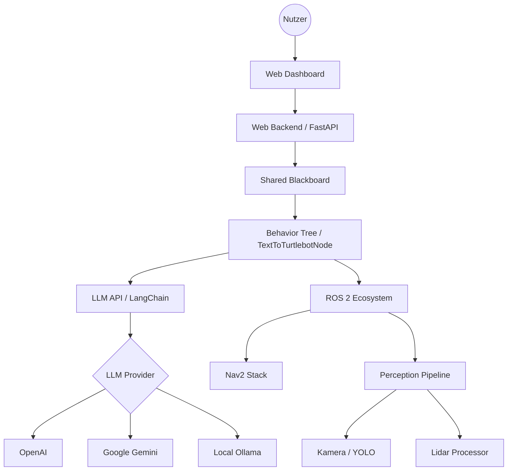
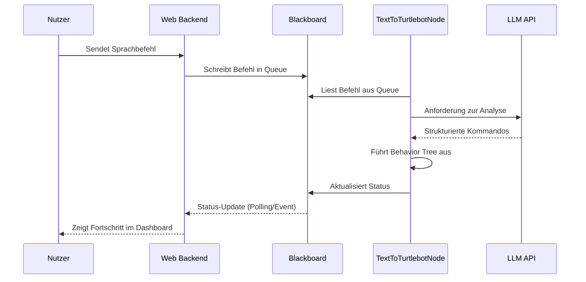
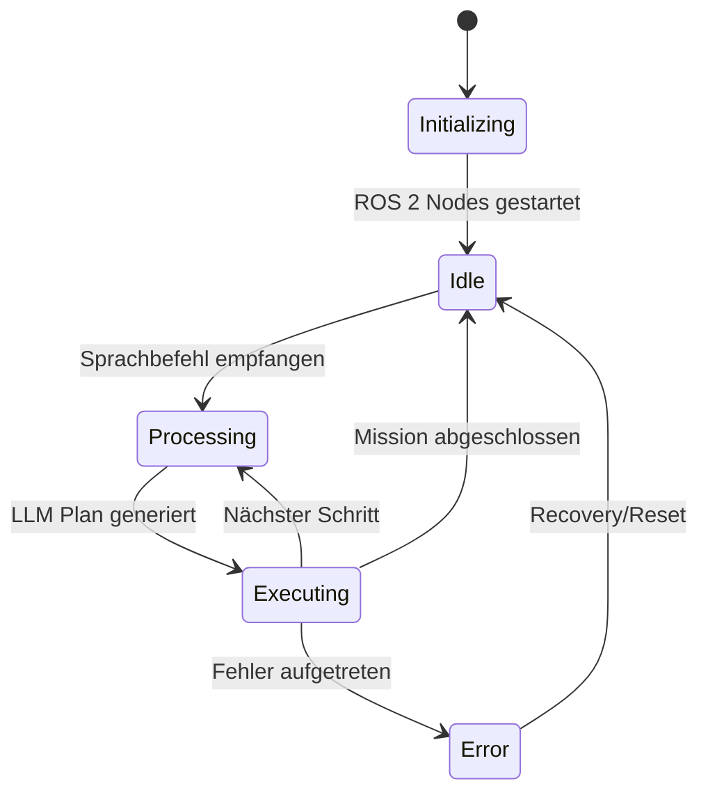

# Architektur

TextToTurtleBot ist modular aufgebaut, um eine flexible Integration von KI-Modellen und Robotersteuerung zu ermöglichen.

## Systemübersicht

Die folgende Grafik zeigt die grobe Architektur des Systems:

## Datenfluss

Der Datenfluss bei einem Sprachbefehl sieht wie folgt aus:

## Komponenten-Lebenszyklus

## Kernkomponenten

### core/
Enthält die Hauptlogik des Roboters, einschließlich der Verhaltensbäume, LLM-Integration und ROS 2 Schnittstellen.

### shared/
Beinhaltet gemeinsam genutzten Code wie das Blackboard und den Event-Bus, die die Kommunikation zwischen den Modulen erleichtern.

### web/
Beinhaltet das FastAPI-Backend und das Frontend für das Monitoring-Dashboard.
