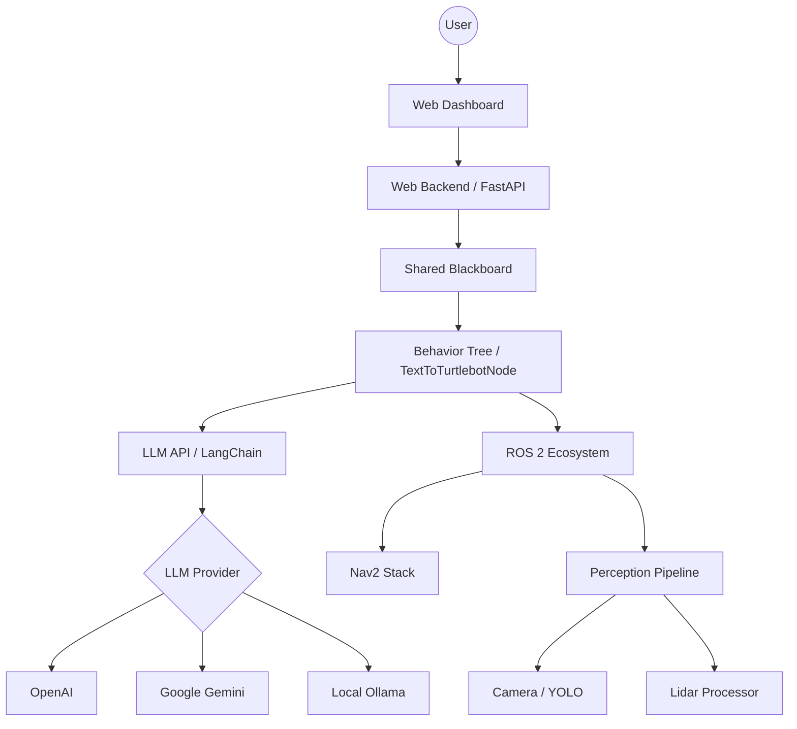
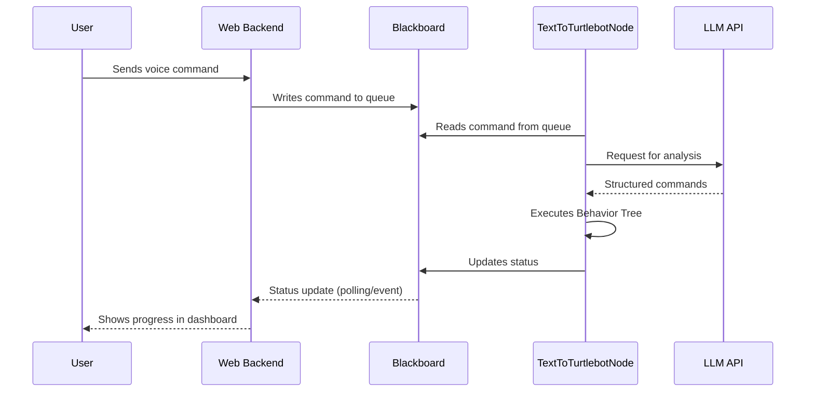
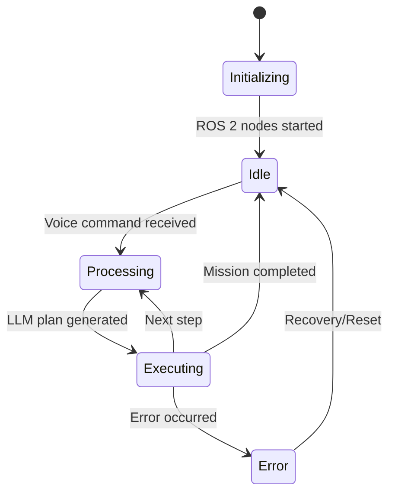

# Architecture

TextToTurtleBot is modularly structured to allow flexible integration of AI models and robot control.

## System Overview

The following diagram shows the high-level architecture of the system:

## Data Flow

The data flow for a voice command is as follows:

## Component Lifecycle

## Core Components

### core/
Contains the main logic of the robot, including behavior trees, LLM integration, and ROS 2 interfaces.

### shared/
Includes shared code such as the blackboard and event bus, which facilitate communication between modules.

### web/
Includes the FastAPI backend and the frontend for the monitoring dashboard.
