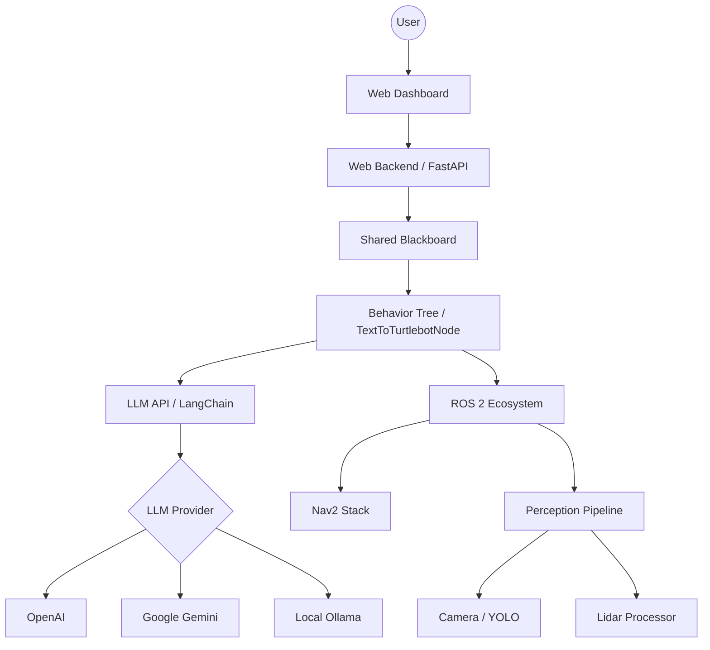

# Architecture

TextToTurtleBot is designed modularly to allow for flexible integration of AI models and robot control.

## System Overview

The following diagram shows the high-level architecture of the system:

## Data Flow

The data flow for a voice command is as follows:

1.  The user enters text in the **Web Dashboard**.
2.  The **Web Backend** receives the text and forwards it to the **TextToTurtlebotNode**.
3.  The **LLM API** service analyzes the text using an LLM adapter and generates structured commands.
4.  These commands are fed into the **Behavior Tree**.
5.  The behavior tree executes the corresponding **Skills** (e.g., navigation, object search) by interacting with the **ROS 2 Ecosystem**.
6.  State and sensor data are continuously synchronized via the **Blackboard** and visualized in the dashboard.

## Core Components

### core/
Contains the main logic of the robot, including behavior trees, LLM integration, and ROS 2 interfaces.

### shared/
Includes shared code such as the Blackboard and Event Bus, facilitating communication between modules.

### web/
Includes the FastAPI backend and the frontend for the monitoring dashboard.
